# Freelance Co-working Contract

## A website build for a start up

**By Nayomi Morita**

# Description
* _A site designed for a diverse co-working environment_

# User Stories:

# _Bill_

### Needs:
* _An easy way to find details about subscription cost as well as a way to easily manage said subscription_

### Pain points:
* _Confusing subscription processes, vague descriptions_

### How we can serve:
* _Create a simple direct subscription setup that allows you to easily subscribe and manage such subscription_

# _Jane_

### Needs:
* _A straightforward layout that makes it easy to find info about the site_

### Pain Points:
* _Counter-intuitive site layout, overwhelming amount of pages, long boring descriptions_

### How we can serve:
* _Use short descriptions that make things very clear, only use pages we need, search bar to easily see all pages to look at_

# Research:
* _I had no idea what a co-working company was so I had to figure that out. Turns out it's just a place for people to get work done instead of at home with people that want the same kind of work environment as them_

# Paper Sketchs:

### Landing Page:

### Contact Page:
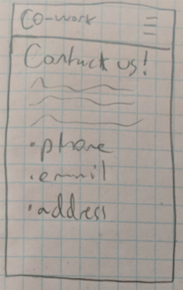

### Amenities:
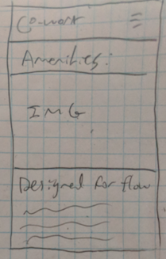

### Membership:
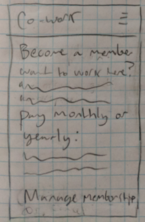

# Wireframe Sketchs:

### Landing Page:
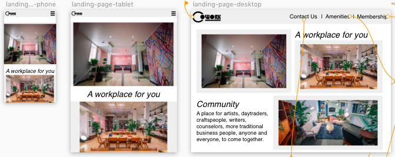

### Contact Page:
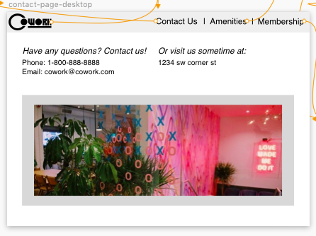
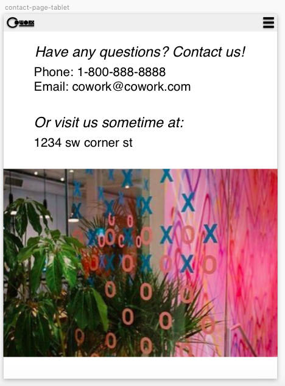
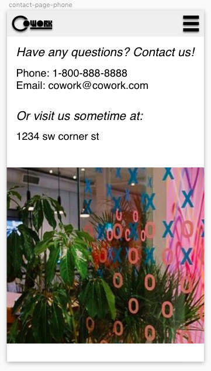

### Amenities:
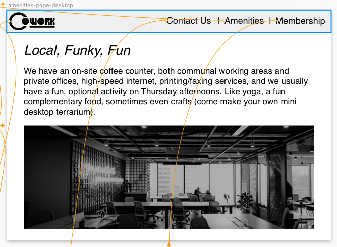
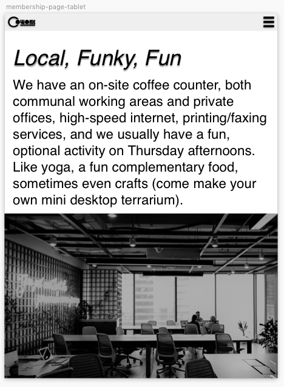
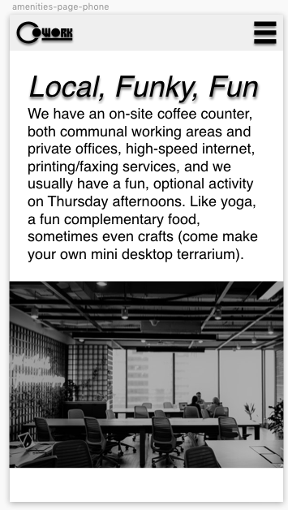

### Membership:
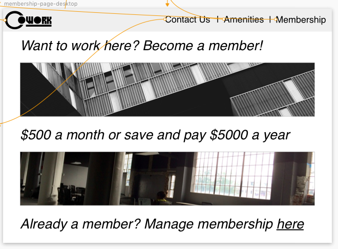
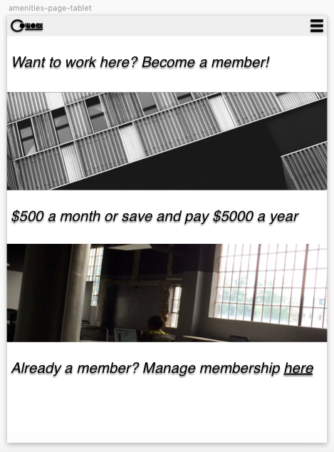
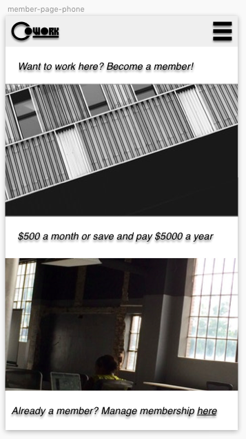

## Setup

* _Clone this repository_
https://github.com/nayomi-morita/start-up.git
* _Use chosen code editor to make changes (I used atom)._
* _Install node/homebrew on device_
* _Run "npm install" in terminal in start-up project_
* _Run "npm run start" to open index.html in browser_

## Technologies used
* _HTML_
* _CSS_
* _SASS_
* _Sketch_

### license

Copyright (c) 2019 **Nayomi Morita**

This software is licensed under the GPL license.
